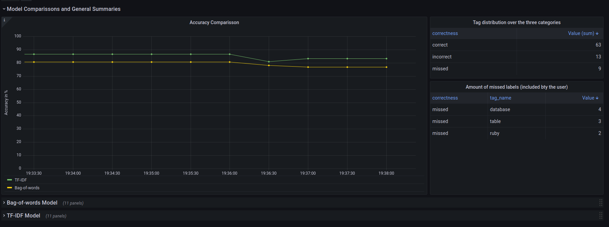
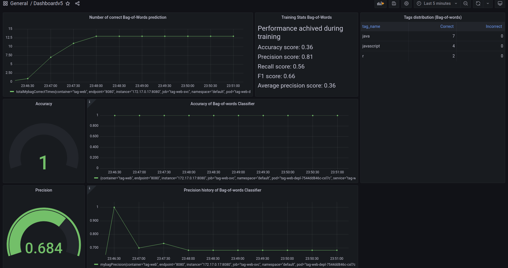

# Using monitoring to improve model performance

## Prerequisites
To run the project, you need to first install [Docker](https://docs.docker.com/engine/install/) and [Kubernetes](https://minikube.sigs.k8s.io/docs/start/). For Kubernetes, we recommend to use *minikube*, as it has all the necessary components to run Kubernetes locally.

Additionally, you need to install Prometheus and Grafana. This can be done using [helm](https://helm.sh/docs/intro/install/) and then installing the Prom stack from [artifacthub.io](https://artifacthub.io/packages/helm/prometheus-community/kube-prometheus-stack).

## How to run the code
To run the code, you need to first start Kubernetes. If you are using *minikube*, this can be done with the following command ``minikube start``. 

Then you can run the deployment with ``kubectl apply -f deployments/monitoring.yml``. This will automatically download the pre-built images from the remote repo.

You can access GUI of the Web app on "192.168.49.2/tag/".

To access the dashboard you need to portforward to Prometheus and Grafana. This can be done with:
```
kubectl port-forward <YOUR_PROMETHEUS_POD> <PROMETHEUS_PORT> (The port is typically 9090)
kubectl port-forward <YOUR_GRAFANA_POD> <GRAFANA_PORT> (The port is typically 3000)
```

After that you can access Grafana on "localhost:<GRAFANA_PORT>". Then you can import the JSON of our dashboard which is located in the grafana directory.
## Code structure 
    .
    ├── .dvc    
    │   └── config              # Configuration of DVC               
    ├── .github/ workflows      # Includes the pipelines
    │   └── docker_public.yml   # Publishes the containers to the repo (only on new Tag)
    │   ├── pylint.yml          # Linting (on Push)
    │   └── pytest.yml          # Running the tests (on Push)
    ├── data                    # Stores the datasets
    ├── deployments             # Includes the Kubernetes and Docker compose config
    │   ├── docker-compose.yml  # Docker compose file - works with local containers
    │   ├── localmonitoring.yml # Config of the K8s deployment using containers located in the local registry
    │   └── monitoring          # Config of the K8s deployment using containers located in the remote registry
    ├── grafana                 # Includes the source of the Grafana dashboard
    ├── myweb                   # Includes the source code of the Web app.
    ├── src                     # Source files for the ML models
    │   ├── analysis 
    │   ├── classification 
    │   ├── evaluation 
    │   ├── preprocessing 
    │   ├── transformation
    │   └── validation           # Tensorflow Data Validation
    ├── tests                    # Automated tests 
    ├── Dockerfile               # To build the model container
    ├── requirements.txt         # Requirements
    └── README.md

### Important code for the models
1. src.training_classifier_mybag / src.training_classifier_tfidf - lauches a subroutine to train a model. The result is dump of the model in the data folder.
2. src.evaluation.evaluate_mybag / src.evaluation.evaluate_tfidf -  lauches a subroutine to evaluate a model. The result is a log with the metrics achieved.
3. src.serve_models - used to create the "/predict" endpoint. The webapp posts requests to it and it replies with json which contains the predictions.

### Important Code structure of myweb
myweb is a Java Spring web app 
1. myweb.src.main.java - contains the source code of the web app - managing the endpoints and sending of the metrics. 
2. src.main.resources - contains the ui of the app

## Different views from the dashboard




## If you want to learn more about our project you can check out our [paper](paper.pdf).